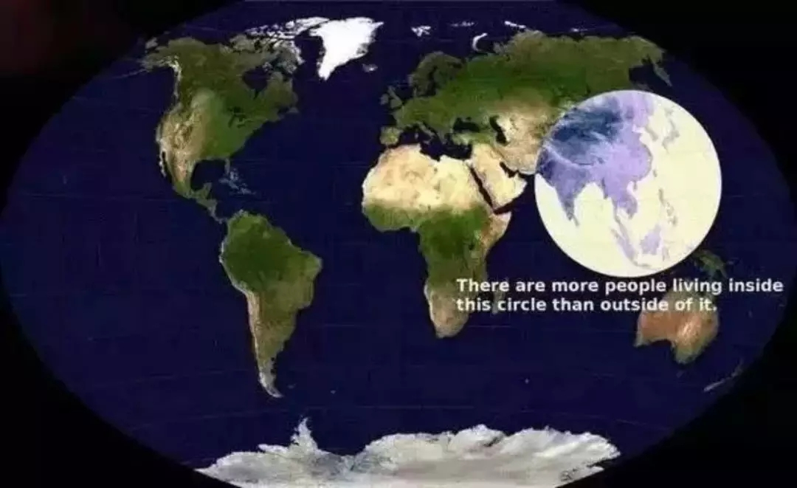
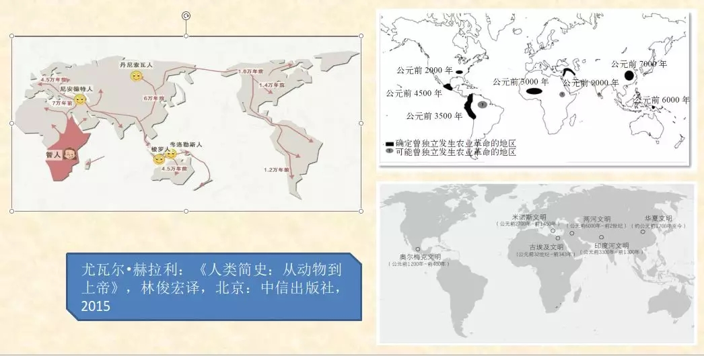
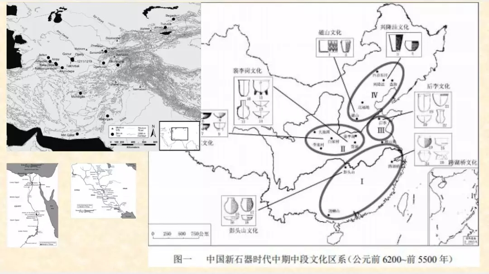
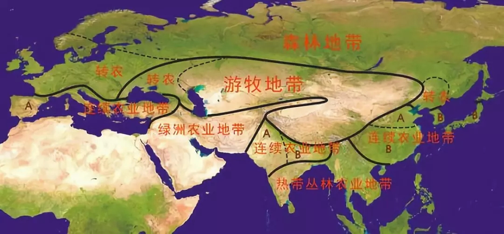
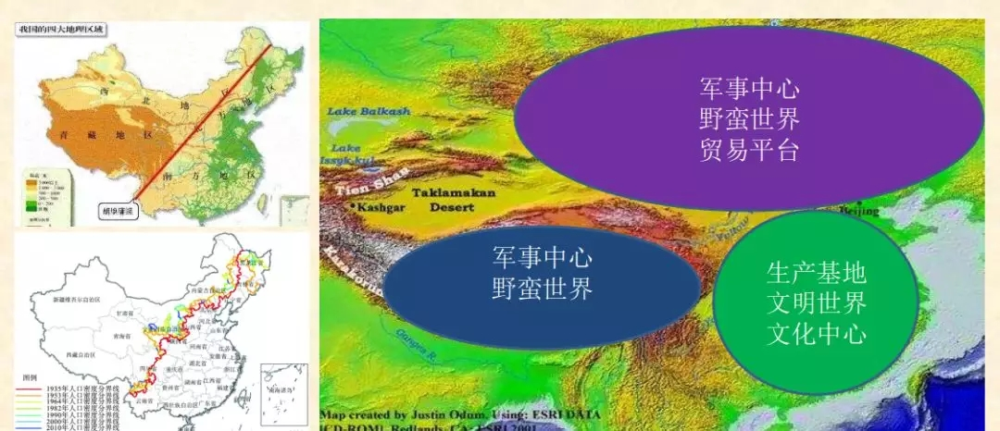

# [中华民族从哪里来，到哪里去][zz]
## 文扬

### 从人口说起

<!--  -->

<!-- &emsp; 全角 &ensp; 半角 &nbsp; 连续 -->
&emsp;&emsp;这个图很有解释力，全世界一半以上的人口在这个圆圈当中，我们可以叫它“半数以上人口圆”，为什么会出现这个现象？显然不是从一开始就这样。  

### 在智人与文明之间发生了什么？

&emsp;&emsp;当代的人类学、考古学的发展，已经构建出关于智人如何遍布世界的完整过程，大概7万年前，智人从东非一直向北，到了亚洲大陆，也到了欧洲，后来通过白令海峡到了美洲大陆，再到南美，也到了澳洲。正是在智人时代与文明的发生这之间发生了一些情况，才造成了日后人类文明的几大分布。  

### 植物的分布

&emsp;&emsp;当此图是NASA（美国国家航空航天局）于2014年拍的。原本要研究碳排放的问题，但图中反映出了在世界上不同地区森林和牧场、草地、植物分布情况，连续植物茂盛地区在这张图上显示为绿色，而浅绿色的那些地区，都是很晚以后才有了文明。非洲和南美的亚马逊这一带，因为气候太热实际也没有发展出连续的农业文明。如此看来，远东的中国中原和华南地区、印度以及中南半岛，从植物的分布上看，就有先天的有利条件。 
&emsp;&emsp;当考古界有句话叫满天繁星，我们的文明是在一个非常广阔的区域内基本上同时开始发展。1915年英国的一位地理学家，就把中国黄河中下游这一带和埃及尼罗河的两幅等比例尺的地图放在一起比较，后者明显要大得多，所以中国很早就出现了"禹贡九州"的概念，我们是在一个近乎圆形地理区域内分布着九个州，也有十二州的说法。这个圆形区域在春秋战国期间就基本连成片了，这个情况在世界其他地方没有。

&emsp;&emsp;当此图也是等比例尺的，左上角是中亚、东欧，和整个中国的土地上相比，也相对要小很多。左下角是尼罗河和两河，等比例尺来看，是两块很小的地方。所以，虽然埃及文明与两河文明更早，但他们是在很小的区域内发生的，没有出现大片的文明。而现在考古越来越多的证据证明，我们是在一个很广阔的土地上开始了我们的文明，这就使得这里发生的农业革命从一开始就大大区别于其他地区的农业定居文明。

&emsp;&emsp;当《周礼》中描述"凡四海之内九州，州方千里。州，建百里之国三十，七十里之国六十"。《禹贡》中"五百里甸服，再五百里侯服，再五百里绥服，再五百里要服，再五百里荒服"，这是最初五服的概念，我们对周围蛮夷戎狄的认知，是随着距离的延长，离文明中心越远越野蛮，五个五百里之后，到了荒服之外就是化外之地了。这种文明中心的观念在其他地方是不存在的，两河、安纳托利亚、埃及等这些地方，定居区与游动的蛮族都混杂在一起，没有一个固定的中心区域。所以，天下观念的形成是和地理区域密切相关。我们的文明从一开始就非常的特殊。
### 亚欧大陆农业带分布

&emsp;&emsp;当我们的祖先是伟大的农业革命的先驱者，很早就开始建立了连续的农业文明。如图可知，欧亚大陆的中心地带都是游牧地带，但游牧和定居完全是两种文明，连道德标准都是不同的。图中"转农"的意思是，很晚才开始连续农业。中国的东北、朝鲜半岛、日本列岛也都是转农。西伯利亚森林冻土带没有连续的农业文明。相较而言，最重要的连续农业地带就是印度河流域和黄河、长江流域，而黄河、长江流域又是世界上面积最大的连续农业地带。

&emsp;&emsp;当今天的中华人民共和国当然是整个中华文明的继承者，所以它不应该仅包含中原文明，我们并不是只有夏商周、战国秦汉、魏晋南北朝、隋唐、宋元明清，这只是中原这部分的历史，我们还要包含草原文明，也就是游牧地带，应把蒙古高原，从匈奴、东胡、鲜卑、高车、柔然、突厥、回鹘、契丹、蒙古等这一部分历史也都结合到中国历史中。图中圆圈的部分是连续农业地带，很早就发生了中华文明的地方。绿色部分就是草原帝国的发生地。中华历史主要是这两大部分历史过程的混合。

### 中国历史运动的地理起点

&emsp;&emsp;当如左上图所示，这是著名的"胡焕庸线"，从瑷珲到腾冲，大概是45度角的线。当时，这条线以东聚集了中国94%的人口，随着西部大开发人口迁徙，这条线到今天变得弯弯曲曲，但大体上还是这条线。历史上，此线也是定居地带和游牧地带分界线的一部分。若以中华人民共和国的版图来理解，我们的历史运动中心至少有三个，如图所示，1、东南部：生产基地、文明世界、文化中心，2、北方：军事中心、野蛮世界、贸易平台。3、西部高原：军事中心、野蛮世界。如此看来，从夏商周到现在4000多年，大部分时期里，军事中心在北方，贸易中心也在北方。  

### “天下”型定居文明：天治主义
&emsp;&emsp;当以自然环境为起点会发现，中华文明的核心就是"天治主义"，为什么观念当中始终会有"天"，这和我们的自然环境是密切相关的。《尚书》中提到，"天叙有典，敕我五典五惇哉！"意为上天既然安排了君臣、兄弟、父子、夫妇、朋友之间的伦常次序，便应当顺从上天的意旨，并使这种关系深厚起来啊！先秦诸子的政治思想史，若放在世界各文明当中来比较，特点是很鲜明的，老子会说，"天之道，损有余而补不足"，意思是什么都不要做，一切都安排好了，一切都是富足的。墨子则更甚，人之间不用互相争斗，一切都会好的。先秦诸子之间互相有各种思想的斗争，但关于"天治主义"的方面的主张是共通的。然而，这种思想在中东沙漠地带则不可能产生，两个游牧部落相遇了，在生存资料极为有限的条件下，不是我抢你就是你抢我。  

### 神治主义：印度“恒法”

&emsp;&emsp;当印度的自然条件丰沃，文明发展较早，沿印度河流域很早就有了大批城市。但直到今天为止，印度都是典型的神治主义，主张灵魂永存，万物有灵，因果报应，人生轮回。生命不是以生为始，以死告终，而是无穷无尽，每一段生命都是由前世的所为而限制和决定的。一个人的善行能使他升为婆罗门，恶行则能令他堕为首陀罗、贱民甚至畜类。因此，个人必须通过修行和积累功德才能认知梵，与梵合一。

[zz]: http://rdcy-sf.ruc.edu.cn/Index/news_cont/id/51020.html "原文"
