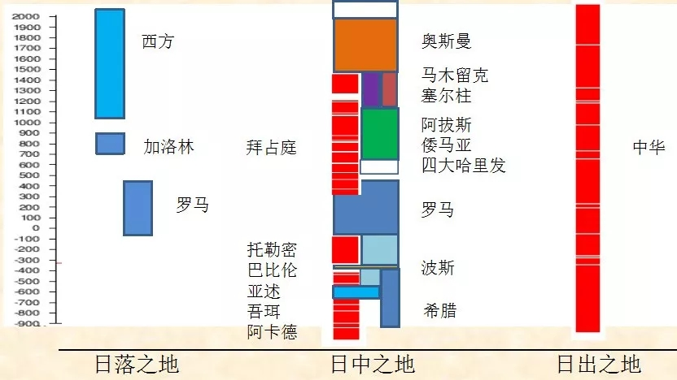

# [中华民族从哪里来，到哪里去][zz]
## 文扬

### 从人口说起

<!--  -->

<!-- &emsp; 全角 &ensp; 半角 &nbsp; 连续 -->
&emsp;&emsp;这个图很有解释力，全世界一半以上的人口在这个圆圈当中，我们可以叫它“半数以上人口圆”，为什么会出现这个现象？显然不是从一开始就这样。  

### 在智人与文明之间发生了什么？

&emsp;&emsp;当代的人类学、考古学的发展，已经构建出关于智人如何遍布世界的完整过程，大概7万年前，智人从东非一直向北，到了亚洲大陆，也到了欧洲，后来通过白令海峡到了美洲大陆，再到南美，也到了澳洲。正是在智人时代与文明的发生这之间发生了一些情况，才造成了日后人类文明的几大分布。  

### 植物的分布

&emsp;&emsp;此图是NASA（美国国家航空航天局）于2014年拍的。原本要研究碳排放的问题，但图中反映出了在世界上不同地区森林和牧场、草地、植物分布情况，连续植物茂盛地区在这张图上显示为绿色，而浅绿色的那些地区，都是很晚以后才有了文明。非洲和南美的亚马逊这一带，因为气候太热实际也没有发展出连续的农业文明。如此看来，远东的中国中原和华南地区、印度以及中南半岛，从植物的分布上看，就有先天的有利条件。

&emsp;&emsp;考古界有句话叫满天繁星，我们的文明是在一个非常广阔的区域内基本上同时开始发展。1915年英国的一位地理学家，就把中国黄河中下游这一带和埃及尼罗河的两幅等比例尺的地图放在一起比较，后者明显要大得多，所以中国很早就出现了"禹贡九州"的概念，我们是在一个近乎圆形地理区域内分布着九个州，也有十二州的说法。这个圆形区域在春秋战国期间就基本连成片了，这个情况在世界其他地方没有。

&emsp;&emsp;此图也是等比例尺的，左上角是中亚、东欧，和整个中国的土地上相比，也相对要小很多。左下角是尼罗河和两河，等比例尺来看，是两块很小的地方。所以，虽然埃及文明与两河文明更早，但他们是在很小的区域内发生的，没有出现大片的文明。而现在考古越来越多的证据证明，我们是在一个很广阔的土地上开始了我们的文明，这就使得这里发生的农业革命从一开始就大大区别于其他地区的农业定居文明。

&emsp;&emsp;《周礼》中描述"凡四海之内九州，州方千里。州，建百里之国三十，七十里之国六十"。《禹贡》中"五百里甸服，再五百里侯服，再五百里绥服，再五百里要服，再五百里荒服"，这是最初五服的概念，我们对周围蛮夷戎狄的认知，是随着距离的延长，离文明中心越远越野蛮，五个五百里之后，到了荒服之外就是化外之地了。这种文明中心的观念在其他地方是不存在的，两河、安纳托利亚、埃及等这些地方，定居区与游动的蛮族都混杂在一起，没有一个固定的中心区域。所以，天下观念的形成是和地理区域密切相关。我们的文明从一开始就非常的特殊。

### 亚欧大陆农业带分布

&emsp;&emsp;我们的祖先是伟大的农业革命的先驱者，很早就开始建立了连续的农业文明。如图可知，欧亚大陆的中心地带都是游牧地带，但游牧和定居完全是两种文明，连道德标准都是不同的。图中"转农"的意思是，很晚才开始连续农业。中国的东北、朝鲜半岛、日本列岛也都是转农。西伯利亚森林冻土带没有连续的农业文明。相较而言，最重要的连续农业地带就是印度河流域和黄河、长江流域，而黄河、长江流域又是世界上面积最大的连续农业地带。

&emsp;&emsp;今天的中华人民共和国当然是整个中华文明的继承者，所以它不应该仅包含中原文明，我们并不是只有夏商周、战国秦汉、魏晋南北朝、隋唐、宋元明清，这只是中原这部分的历史，我们还要包含草原文明，也就是游牧地带，应把蒙古高原，从匈奴、东胡、鲜卑、高车、柔然、突厥、回鹘、契丹、蒙古等这一部分历史也都结合到中国历史中。图中圆圈的部分是连续农业地带，很早就发生了中华文明的地方。绿色部分就是草原帝国的发生地。中华历史主要是这两大部分历史过程的混合。
当
### 中国历史运动的地理起点

&emsp;&emsp;如左上图所示，这是著名的"胡焕庸线"，从瑷珲到腾冲，大概是45度角的线。当时，这条线以东聚集了中国94%的人口，随着西部大开发人口迁徙，这条线到今天变得弯弯曲曲，但大体上还是这条线。历史上，此线也是定居地带和游牧地带分界线的一部分。若以中华人民共和国的版图来理解，我们的历史运动中心至少有三个，如图所示，1、东南部：生产基地、文明世界、文化中心，2、北方：军事中心、野蛮世界、贸易平台。3、西部高原：军事中心、野蛮世界。如此看来，从夏商周到现在4000多年，大部分时期里，军事中心在北方，贸易中心也在北方。  

### “天下”型定居文明：天治主义

&emsp;&emsp;以自然环境为起点会发现，中华文明的核心就是"天治主义"，为什么观念当中始终会有"天"，这和我们的自然环境是密切相关的。《尚书》中提到，"天叙有典，敕我五典五惇哉！"意为上天既然安排了君臣、兄弟、父子、夫妇、朋友之间的伦常次序，便应当顺从上天的意旨，并使这种关系深厚起来啊！先秦诸子的政治思想史，若放在世界各文明当中来比较，特点是很鲜明的，老子会说，"天之道，损有余而补不足"，意思是什么都不要做，一切都安排好了，一切都是富足的。墨子则更甚，人之间不用互相争斗，一切都会好的。先秦诸子之间互相有各种思想的斗争，但关于"天治主义"的方面的主张是共通的。然而，这种思想在中东沙漠地带则不可能产生，两个游牧部落相遇了，在生存资料极为有限的条件下，不是我抢你就是你抢我。  

### 神治主义：印度“恒法”

&emsp;&emsp;印度的自然条件丰沃，文明发展较早，沿印度河流域很早就有了大批城市。但直到今天为止，印度都是典型的神治主义，主张灵魂永存，万物有灵，因果报应，人生轮回。生命不是以生为始，以死告终，而是无穷无尽，每一段生命都是由前世的所为而限制和决定的。一个人的善行能使他升为婆罗门，恶行则能令他堕为首陀罗、贱民甚至畜类。因此，个人必须通过修行和积累功德才能认知梵，与梵合一。

&emsp;&emsp;印度按照种姓制度把人划分为4个等级，分别是婆罗门、刹帝利、吠舍和首陀罗。在首陀罗之外还有一种不可接触者。虽然印度自然环境和我们有相近之处，但是文化却完全不同。黑格尔在《历史哲学》里有一句著名的话，"印度对于事物的见解是一种'普遍的泛神论'，但是是一种'想象'的泛神论，而不是'思想'的泛神论。"这在今天依然有解释力。  

### 法治主义：汉谟拉比法典

&emsp;&emsp;汉谟拉比法典将人分为三种等级：有公民权的自由民、无公民权的自由民、奴隶（王室奴隶、自由民所属奴隶、公民私人奴隶）。该法典较为完整地继承了两河流域原有的法律精华，使其发展到完善地步。它公开确认奴隶主阶级的统治地位，严格保护奴隶主阶级的利益，并对各种法律关系作了比较全面的规定。汉谟拉比法典的形成是当时社会经济制度的产物，反映出当时社会各方面的现实。  

### 新型神治主义：基督教

&emsp;&emsp;基督教的出现在古代是革命性的，其根本性观点在其他任何文明中都没有产生过，我把基督教叫做新型神治主义。它认为，当前所受的苦难是反常且无法容忍的。圣经告诉人们，目前的一切是可以改变的，在未来某个时期你就可以过上永远快乐，永远幸福的生活。而其他文明则认为，这是天注定的，神就是这样来安排，并不会想到去改变。   

&emsp;&emsp;在中国的传统文化中，天是一种秩序，天子就是法。但是基督教中，先知们的新型司法，超越了国王的简单公义，不再满足于原来的秩序，而是要改变现有秩序，创造出一个更好的社会状态。按《圣经》所述，耶稣升天后会很快回来，回来后便是末日审判，好人升天，坏人下地狱。13世纪教皇革命前夕，人们开始怀疑，已经一千多年了，耶稣怎么还不回来？后来，他们得出此结论，上帝为什么不降临？因为人间的罪恶太多，耶稣没办法回来。所以人类必须得有所作为，一起积德行善，清除掉世间所有罪恶之后才能一起迎接弥撒的降临。归结起来叫做"己所欲，施于人"，与孔子教导的"己所不欲，勿施于人"正好相反。  

### 兽治主义：游牧部落

&emsp;&emsp;草原游牧部落可称为兽治主义，崇拜野兽而不是天。逐水草而居的游牧部落不会出现中心，因为不知道明天会到哪儿去。所以，古书上论述匈奴和突厥的时候，总是把他们当作兽不是人，人面兽心是古书里常用的成语。  

&emsp;&emsp;周朝时期，亶父古公带着整个部落回歧山，那时候我们就产生了"老吾老以及人之老，幼吾幼以及人之幼"的思想，扶老携幼，整个部落回到关中平原来。这种文明在蛮族中很长时间都没有产生。匈奴部落里，青壮年坐在桌上喝酒吃肉，老人萎缩在角落里吃剩饭。这是由他们的资源、经济条件所决定的，部落要迁徙无法带走那么多老人，老人只能自生自灭。所以，这和中原文化恰恰相反。  

### 公元后第一个千年人口变化

&emsp;&emsp;所谓的"天治文明"，一方面有最适合农业革命的自然条件，另一方面又产生了最适合定居的文明和农业革命的天治主义思想，所以如图所示公元后第一个千年，中国的人口越来越多，印度的人口越来越多，而世界其他地区人口的变化是很缓慢的。  

### 冀朝鼎：基本经济区的5次转移

&emsp;&emsp;经济学家冀朝鼎在他的《中国历史上的基本经济区》书中揭示了中国主要基本经济区的几次转移，正如书中所言："占优势的经济区一旦确定，控制了基本经济区的首领，就获得了优越的物质利益，而胜过与之竞争的其他集团，最后把国家统一起来"，这个理论放在中华民族的历史中很有解释力。    

&emsp;&emsp;如图所示，三国时期正好是三个基本经济区，北方地区，长江中下游地区以及蜀经济区。四川盆地地区和中原历史始终都是不合拍的，往往是中原王朝覆灭了，蜀地的王朝还会持续一段时间。新的中原王朝建立后，蜀地很晚才开始融进来。隋唐时期实际是草原建立的帝国，汉地、汉人在帝国中主要发挥生产力和文化力的作用。帝国使得北方与南方融合在一起，经济区大大扩大。宋辽金时期进一步扩大。到了元明清时期，由于南方北方经济区都在逐渐扩大，反而出现了南北两块经济区现象。所以要通过大运河把南北两个经济区联系起来。为防止蒙古南下,巩固北方边防，明成祖朱棣迁都北京。所以就进一步催生了首都经济，南方便成了供应首都地区消费的生产基地。  

&emsp;&emsp;总结起来，中华历史上主要是分为以下“四个力”，称为“四力模型”：  

&emsp;&emsp;生产力：关于定居，土地、物产、劳作。  

&emsp;&emsp;军事力：关于征伐、农战、掠夺、索贡。  

&emsp;&emsp;文化力：仁义、礼乐、怀柔、交邻。    

&emsp;&emsp;贸易力：通商、边贸、盟约，市舶。  

&emsp;&emsp;通过这四个力，中原和草原之间相互博弈，可以解释中国历史上大部分的现象。  

### 生产力的“周期律”

&emsp;&emsp;历史上，中国的GDP总量曾多次排名世界第一，为验证这一点，经济学家李稻葵组织了一个小组，根据掌握的资料画出此图，北宋时期，公元1005年的澶渊之盟，北宋每年送给辽岁币银10万两、绢20万匹，以此换来120年的和平。由此得知，GDP走势与国家和平局势有很大的关联。如今，中国的制造业早在2010年超美国跃居世界第一，中国是全世界唯一拥有联合国产业分类中全部工业门类的国家。这个现象又出现了，只要给我们几十年的和平，便可冲击世界第一。

### 文化力的大分流

&emsp;&emsp;在文化力方面，胡汉两种文化，从周公、孔子之后就开始分流了，实际上，中原和草原在很多方面都是完全对立的。道德上来讲，中原讲"仁"，草原讲"义"；中原讲"文"，草原讲"武"；中原讲"礼"，草原讲"蛮"；古代时期，野蛮在草原游牧民族中是好的道德，例如，杀人如麻自然是好的，因为不杀敌人，自己的部落该如何生存？首领好色，当然是也是好的道德，否则部落怎么能扩大呢？而中原文化则认为，非礼勿亲，非礼勿视。由此可知，以上完全是根据不同自然环境和经济基础而决定的。我们是安土重迁，争的是所有权。而草原文明中，所有权没有意义，要的是移动权。大单于称王的关键在于他能扩大活动范围，能够在广阔的范围内让他的部落获得生存资料，不断获得新鲜血液。

### 军事力的大分流

&emsp;&emsp;中华历史上，只有少数人曾经战胜过草原。第一，赵武灵王，胡服骑射，不惜改变全国的风俗习惯礼仪，向胡人学习骑射，改掉宽袍大袖。春秋时期，中原人打仗是用战车，在礼仪上先礼后兵，互相排好队形后双方开始说话，说完后开始你一车我一车的交战，而北方的游牧民族都是一人一马，整个马队像乌云一样就压过来了，怎么打得过？赵武灵王放弃战车，将士全部骑马，驱匈奴七百里，取得胜利。战功与霍去病、卫青相当。第二，秦始皇；第三，汉武帝。还有魏晋南北朝时期，南朝的宋武帝，也战胜过胡人，差一点就统一了北方。

&emsp;&emsp;再之后中原就从来没有真正战胜过草原，隋唐实际都是草原建立的，为了自己和子孙万代永远坐稳皇帝宝座，胡人在中原建立政权后主动汉化。隋文帝杨坚其实不姓杨，叫普六茹那罗延。李唐皇室既有鲜卑的血统也有突厥的血统。李世民的儿子李乾承常年住账篷，不住宫殿，家里不用汉人，全是突厥的兵，学习也都是骑马射箭，李世民则让他学书法，学四书五经，希望他能结合中原草原两种文化去理解中华文明。

### 贸易力的大分流

&emsp;&emsp;在贸易力方面，汉朝是扩张的，南北朝时期被草原控制了，隋唐也是被草原控制的。宋朝以后中原经济区越来越靠近南方，一直到海边，这时候海上贸易就出现了；到蒙元时期，整个北方草原贸易通道是畅通的。意大利旅行家马可波罗顺利来到中国，那是一次全球化；到明朝时期，海上贸易就更加繁盛。

### 定居文明

&emsp;&emsp;秦汉时期第一次实现了生产力、军事力、贸易力、文化力的"四力合一"，达到了中国历史上中原定居文明第一个高峰。南北朝时期是中原定居文明大收缩，隋唐实际是北魏的继承。北魏时期的文化和种族已经是草原的了，不是中原的了。隋王朝虽然实现了统一，然而，中亚地区大量新国家出现了，成为欧亚大陆上新的军事力和贸易力中心，而隋王朝更多是一个生产力中心。大唐是又一次中原和草原的四力合一，再一次达到历史的顶峰，但大唐帝国也是草原建立的。

&emsp;&emsp;北宋时期国家是有边界的，在今天的白洋淀、雄安这一带。我命名了一个词叫"北宋圆"，这是我们最核心，最具蓬勃的生产力、文化力的区域。南宋时期中原定居文明再次大收缩，蒙元灭南宋是一次真正的亡国灭种。"崖山海战"，宁死不投降宰相陆秀夫抱少帝赵昺一起投海自尽。所以，从文化意义上，中国魏晋南北朝时期已经亡过一次国，南宋又亡过一次。但有一个现象，所有入主中原的胡人统治者，最终都把自己汉化了。

&emsp;&emsp;蒙元帝国实现了第一次草原帝国的"四力合一"，草原的军事力、草原的贸易力、中原的生产力、中原的文化力。废除科举，所有的官员都是蒙古人，整个湖南省都是蒙古大将的家奴。蒙古人的特点是，打仗有功便给你一大块土地，土地上所有人都是你的奴隶，汉人很悲惨。不过"胡运不过百年"，朱元璋通过复制了元朝所有的野蛮来重建中原军事力，建立了大明王朝。明朝有着最大的海上贸易力，加上中原的生产力以及复原的文化力。由于已经长期处于和平时期，中原地区经济又发达起来了，明朝的GDP再次成为世界第一，郑和下西洋，海上贸易线已延伸到东非，中原国家再次复兴。

&emsp;&emsp;大清帝国又是一次草原与中原的四力合一，最终中原强大的文化力还是把草原同化了。以上为历史上实际出现的几次四力合一。

### 中华民族的扩大

&emsp;&emsp;中华民族的扩大，就是通过不断的收缩-扩大形成的。如图所示二战时期美军中发布的一个图片，图中出现了China Proper一词，被西方帝国主义用来理解中国，对方称说不要看大清这么大的版图，China Proper之外的都不是中国的。东北叫满洲里，北方是蒙古，西部是新疆、Tibet（西藏），东南这一块才是China Proper。辛亥之秋，武昌的这面以象征十八省铁血团结的"十八星旗"功成名就，成为了辛亥革命的重要标志之一。在孙中山概念里，十八省之外东北、蒙古、新疆，不在中国范围内。所以，在南京成立总统府第三天，孙中山告祭明太祖光复中华。

&emsp;&emsp;历史上，西方国家所定义的China Proper只有几个时期，秦朝、西晋、北宋，明。但我们不得不承认的是，帝国中国的四个时期--西汉、唐、元、清，除了西汉是中原人建立的，其他都是草原建立的。直到今天，仍然有很多问题饱受争议，例如成吉思汗是否为我们的祖先？再例如还如何评价岳飞、卫青、霍去病？若从单纯的中原观点出发，他们是民族英雄，抗击胡人，保家卫国。然而，今天的版图是中原和草原的结合，草原对中华民族的贡献无疑是巨大的。

&emsp;&emsp;当清朝定鼎中原之后，东北就成了清朝的"龙兴之地"。在清朝初期，满清统治者禁止汉人移民到东北，但随着人口的急剧膨胀，再加上戍边的需要，从清朝中后期开始，中原民众大量进入东北。

### 广土巨族的形成

&emsp;&emsp;广土巨族是如何形成的？1923年，梁启超在《五十年中国进化概论》提到“中华民族”，可见其远见卓识。梁启超曾说过，早在中国进入近现代之前，中华民族就已经通过两种途径将自己长成了一个“硕大无朋的巨族”，这是五千年来我们的祖先“从没有间断过的”努力，一方面“把境内境外无数异族叫他同化于我”，成为巨族，另一方面“本族的人年年向边境移殖，把领土扩大”，形成广土。  

&emsp;&emsp;过去，不同民族之间打了几千年，辛亥革命之后，有了中华民族观念之后，我们有了新的视角，一个巨族融合的视角--入主中原的胡人将自己汉化，效忠中原王朝的异族获赐汉姓，内附的蛮夷戎狄人民与汉人融合，外殖的汉人与蛮夷戎狄人民融合，这个中华民族五千年来一直都在扩大，几千年间，直到中国人抬眼看到整个世界，环顾宇内，才发现原来自己竟是唯一的"广土巨族"！  

### 公元第二个千年的人口变化

&emsp;&emsp;如图所示公元第二个千年的人口变化，公元1500年工业革命开始，西方的人口开始多起来。中国作为农业革命唯一最成功的胜利，人口也在持续增多。但到工业文明时期，恰恰当年的农业革命胜利者却成了失败者。  

### 分散狭小的定居文明

&emsp;&emsp;如图所示，地中海分为10块，若以中国西周到秦汉，或印度孔雀王朝，或阿契美尼德王朝等任何一个文明古国的文明标准来衡量，古代欧洲基本上是文明空白，地地道道的野蛮时期、化外之地。近代西方文明真正的诞生，始于十字军东征。在此之前的1000年里，它不过是从极为原始的哈尔施塔特文明和拉坦诺文明缓慢地进化到了一个个信奉基督教的蛮族部落。近年来已经有越来越多的历史著作揭示出：1.古代世界的文明中心并不在地中海，而在亚洲的心脏地区——小亚细亚和伊朗高原；2.文明的传播方向并不是从西向东、向南，而是从东向西、从南向北；3.所谓的“古希腊文明”并不是来自北方的欧洲大陆，而是古代亚洲文明向西、非洲文明向北传播的结果。  

### 三个时代不同的东西方

&emsp;&emsp;如上图所示，红线是东西罗马分治的标志线。黄线是查理曼大帝死后，法兰克帝国一分为三，从罗马到亚琛，查理曼大帝的三个孙子订立《凡尔登条约》，围绕这条黄线瓜分法兰克帝国。蓝线为什切青—的里雅斯特，1946年3月，丘吉尔在美国发表的《和平砥柱》演说中指出：“从波罗的海的什切青到亚得里亚海边的里雅斯特，一幅横贯欧洲大陆的铁幕已经降落下来。”这就是后来的东西方。用绿线来划分蓝线和红线的两个地区。西方说古希腊是西方文明的“古典时期”是毫无依据的，因为它真实的“古典时期”什么都没有。很多学者一说西方言必称希腊与罗马。汤因比把这种母子关系说的非常清楚，他比喻今天的西方社会与古代希腊罗马社会之间的关系就好像是，从旧生物身上拆下来的一根肋骨变成了一个新生物的脊骨。  
### 近代西方的崛起

&emsp;&emsp;如右图所示，“财富大三角”，欧洲从非洲南美搜刮获得财富，成为暴发户。和历史上其他帝国不同的是，西方不是按照一个区域来逐步扩大建立起来的，西方帝国是直接跨海建立的。从下图中就可以看出来它500年是怎么样形成的。  

&emsp;&emsp;日不落国，从1725年-1914年，英国从图中蓝色区域扩张到最后占了世界上那么大的地方，包括南极。  

&emsp;&emsp;这张图也很有解释力，从英国工业革命开始发端，沿着海洋路径把工业革命带到全球，这三个圈恰恰就是离海洋通道最远的三个圈，这也恰恰就是二战后第三世界的亚非拉地区。传统的先进的农业文明成了被压迫文明、落后文明。但是现在我们重新崛起了。   

## 大分化

&emsp;&emsp;如图所示，当时的世界是中国，印度，欧洲鼎足三分之势。1830开始GDP占世界总比陡降，第一次工业革命后引发了一场深刻的社会变革。从上世纪70年代开始，我们终于扛过了这一段艰难的日子，实现工业化，重新崛起了。  

## 帝国视角的世界历史

&emsp;&emsp;中国人过去从没有过"世界历史"（World History）这个观念，西方学者将世界历史串成了一个以古代东方为起点、以近代西方为终点的大事件逻辑链，于是大多数非西方文明就被排除出世界历史的"主线"，成了边缘。这让中国在后来吃了很大的亏。从15至19世纪，真正代表世界历史中心的就是奥斯曼帝国，奥斯曼帝国作为最后一个横跨欧亚非三大洲的帝国，其疆域在极盛时期曾经将三分之二个地中海、整个黑海和红海收入囊中。如果奥斯曼帝国没有解体，和中国面积相当，也是1000多平方公里，也是100多个民族，今日世界的地缘战略格局就会完全不同。如今，中东地区三个主要的大国伊朗、土耳其、沙特，任何一个国家都不能完整地代表奥斯曼帝国。   

## 中华民国：“北宋圆”的重建

&emsp;&emsp;中华民国相当于"北宋圆"的重建，所以，若国民党作为中国执政党，中华人民共和国版图很可能不是现在这样，可能没有东北、新疆和内蒙。毛泽东的战略路线是从西北往东南打，最后国共内战林彪的四野从双城一直打到海南岛，和当年清军的路线一样，一路势如破竹地打下来。   

## 建国前30年，帝国版图的军事防卫和生产基地

&emsp;&emsp;中华人民共和国的版图是帝国中国的版图，不是中原大一统国家的版图，毛泽东主席是拿到如此大的帝国版图的第一个汉人，新中国前三十年在帝国版图上重建了军事防卫和生产基地。以前中国们主要的生产基地没有越出过胡汉庸线，建国前30年重新进行了工业布局。所以，我们再画这四个力的时候，就变成了大圆。  

&emsp;&emsp;此图为用GDP和人口来描绘中华人民共和国的版图，还可看得出北宋的痕迹，所以，"北宋圆"是理解中国的一个关键要素。  

## 改革开放：世界规模的生产力和贸易力

&emsp;&emsp;今年是改革开放四十周年，如今的中国有了世界规模的生产力和贸易力，从2010年开始，中国成为世界第一制造业大国，2017年成为世界第一贸易大国。这样来看，西方对于“中国威胁论”感受实际上是“真实”的，至少特朗普的直觉其实是对的，但他说不出来。目前，西方也很少有战略家能全面解释中国。  

&emsp;&emsp;再看"一带一路"，从学者的角度来分析，也可以理解为重建西汉弧和大明弧，我们把西汉弧丢了1700多年，从那之后，这条贸易通道就不在我们生产基地的直接控制当中了。元朝蒙古人也只管打仗，让色目人当帮手，控制贸易。北宋时海上贸易发达，到了明朝时，这条海洋通道非常发达，就有了郑和下西洋。今天我们在帝国版图内重建了生产基地和军事防卫之后，自然而然要重建西汉弧和大明弧。  

## 改革开放40周年的4个历史坐标

&emsp;&emsp;理解改革开放40周年，无非就以下几种观点，第一，市场经济让中国经济腾飞；第二，是因为我们完成了工业革命，GDP自然就上来了；第三，社会主义艰难探索最终找到规律。我们历史上有过很多次崛起，所以我更倾向于“文明复苏”，再一次复兴，再一次“四力合一”。  

## 帝国循环

&emsp;&emsp;这张表是尤瓦尔·赫拉利在《人类简史》里用过的，他说帝国循环有这些规律，一开始由一小撮人建立的，与西方帝国的建立相似，后来形成了帝国文化。如果把西方看作一个帝国，把西方这五百年看作为帝国循环，和历史上的蒙古帝国、阿拉伯帝国、波斯帝国、罗马帝国相似，那么帝国循环的颠覆者太像中国和印度了，曾经被压迫得很惨的民族学习了统治者的文化、技术。所以，通过解读历史，我们看今天会看得更清楚。  

&emsp;&emsp;如图所示，这是一个变形图，若两个图形越接近说明则说明越达到世界量级。图中中国这块，GDP已经很庞大了，人口也很庞大。

## 科技水平、城市化与网络化

&emsp;&emsp;如图所示，自从中国商品大量引入美国以后，物美廉价的中国商品会使美国的创新能力大大下降。这也是解读中美冲突的视角。中国制造的商品惠及全世界，但同时也把他们的“武功”也都废了。  

## 叙事循环？

&emsp;&emsp;这个世界最后会朝着什么方向走去？古时候有天治主义、法治主义、神治主义、兽治主义等，后来亨廷顿提出把世界划分为三个主要的文化圈，即儒教文化圈、基督教文化圈、回教文化圈。后来又有了自由资本主义、伊斯兰主义、中国社会主义。其实我们始终不在西方的主义之内，共产主义和法西斯主义是新型神治主义的脉络，是圣经叙事的世俗版。若想了解马克思主义，应先读圣经，否则很难读懂马克思。   

&emsp;&emsp;而中国的路线是：天治主义——儒教文明圈——中国社会主义，从5000年前我们就是这么走过来的，所以我们的叙事路径完全不一样。到未来，很可能出现算法统治人类，今后百度、Google会发达到什么程度？它可能比你更了解你自己。算法已经统计了我们关于知识的积累、信息的获取方式甚至关于生活习惯，我们将被算法所控制。

&emsp;&emsp;近几百年来的西方自由主义在持续解体。特朗普的直觉是对的，不纠缠乱七八糟的主义，而是让自己的科技和制造业回流。建议大家读一读赫拉利三部曲《人类简史》、《今日简史》、《未来简史》，关于历史和现实有很多洞见，供大家参考。  

[zz]: http://rdcy-sf.ruc.edu.cn/Index/news_cont/id/51020.html "原文"
